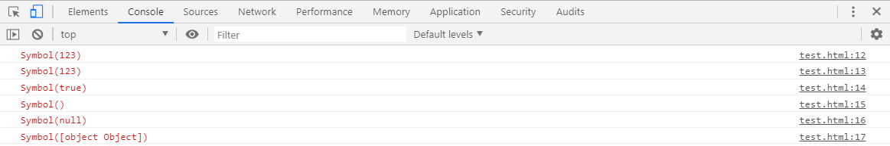
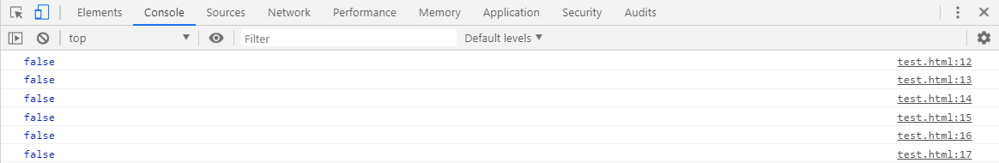

# L-11 Symbol类型
## 概述
> 在ES5中的对象属性名都是字符串，这很容易造成属性名的冲突和覆盖。如果有一种机制，保证每个属性的名字都是独一无二的就好了，这样就从根本上防止属性名的冲突。这就是ES6引入Symbol的原因。
> ES6引入了一种新的原始数据类型Symbol，表示独一无二的值。它是JavaScript语言继undefined、null、Boolean、String、Number和Object之后的第七种基本数据类型。
## 定义Symbol类型
| 语法 | 参数 |
| ---- | ---- |
| Symbol([description]) | description：可选参数，Symbol的描述，可用于调试但不能访问自身 |
* > 可以直接使用Symbol()方法创建新的symbol类型数据，如下：
```js
let s = Symbol();
console.log(typeof s);          //symbol
console.log(s);                 //Symbol()
```
> 也可以向Symbol()方法中传入字符串作为描述符，如下：
```js
let s = Symbol('123');
console.log(typeof s);          //symbol
console.log(s);                 //Symbol(123)
```
> Symbol方法可接受其他6种基本数据类型参数作为描述符，如下：
```js
console.log(Symbol(123));
console.log(Symbol('123'));
console.log(Symbol(true));
console.log(Symbol(undefined));
console.log(Symbol(null));
console.log(Symbol({}));
```

> 创建出来的symbol数据看似相同吗，但是实际上都是独立的一个新的symbol类型数据，如下：
```js
console.log(Symbol('123') === Symbol('123'));
console.log(Symbol(123) === Symbol(123));
console.log(Symbol(true) === Symbol(true));
console.log(Symbol(undefined) === Symbol(undefined));
console.log(Symbol(null) === Symbol(null));
console.log(Symbol({}) === Symbol({}));
```
