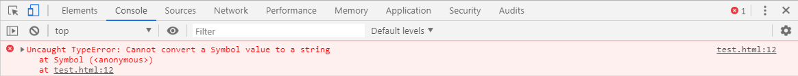
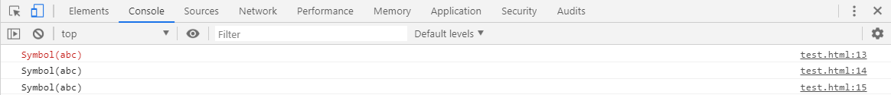
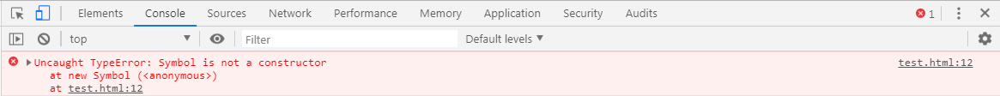
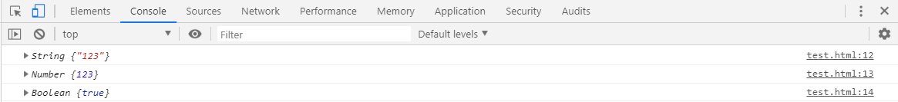
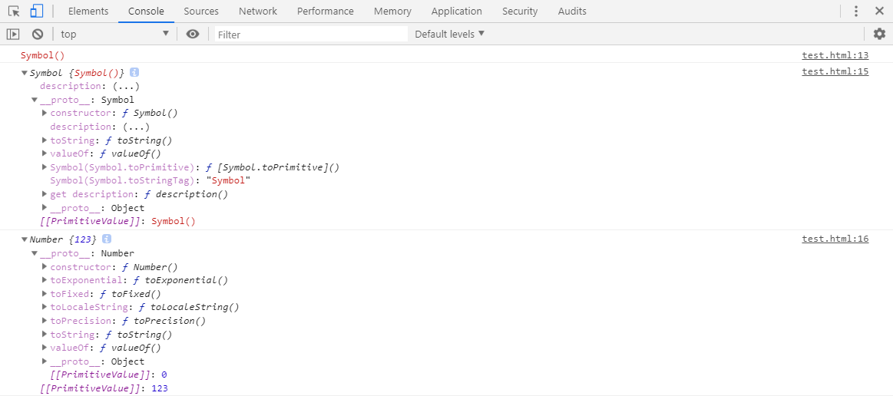

# L-11 Symbol类型
## 概述
> 在ES5中的对象属性名都是字符串，这很容易造成**属性名的冲突和覆盖**。如果有一种机制，保证每个属性的名字都是独一无二的就好了，这样就从根本上防止属性名的冲突。这就是ES6引入**`Symbol`**的原因。
> ES6引入了一种新的原始数据类型`Symbol`，表示独一无二的值。它是JavaScript语言继`undefined`、`null`、`Boolean`、`String`、`Number`和`Object`之后的**第七种基本数据类型**。
## 定义Symbol类型
| 语法 | 参数 |
| ---- | ---- |
| Symbol([description]) | description：可选参数，Symbol的描述，可用于调试但不能访问自身 |
* 可以直接使用`Symbol`方法创建新的`symbol`类型数据，如下：
```js
let s = Symbol();
console.log(typeof s);          //symbol
console.log(s);                 //Symbol()
```
* 也可以向`Symbol`方法中传入**String类型数据**作为描述符，如下：
```js
let s = Symbol('123');
console.log(typeof s);          //symbol
console.log(s);                 //Symbol(123)
```
* `Symbol`方法可接受其他**6种基本数据类型**参数作为描述符，如下：
```js
console.log(Symbol(123));
console.log(Symbol('123'));
console.log(Symbol(true));
console.log(Symbol(undefined));
console.log(Symbol(null));
console.log(Symbol({}));
```

* 创建出来的`symbol`数据看似相同，但是实际上都是独立的一个**新的symbol类型数据**，如下：
```js
console.log(Symbol('123') === Symbol('123'));
console.log(Symbol(123) === Symbol(123));
console.log(Symbol(true) === Symbol(true));
console.log(Symbol(undefined) === **Symbol**(undefined));
console.log(Symbol(null) === Symbol(null));
console.log(Symbol({}) === Symbol({}));
```

* 除了`String`类型的数据之外，当使用其他几种类型数据作为`Symbol`方法的描述符时，会先调用其自身或原型上的`toString`方法。将其转换为`String`类型，再作为`Symbol`方法的描述符创建`symbol`数据。如下示例：
```js
var obj = {
    toString : function () {
        return 'abc';
    }
}
let s = Symbol(obj);
console.log(s);                 // Symbol(abc)
```
* 当使用`symbol`数据作为`Symbol`方法的描述符时，会抛出`TypeError`。如下：
```js
console.log(Symbol(Symbol()));
```

* `symbol`数据不能与其他类型的值进行运算，会报错。如下：
```js
let s = Symbol('abc');
"I am " + s;                // Uncaught TypeError: Cannot convert a Symbol value to a string
`I am ${s}`;                // Uncaught TypeError: Cannot convert a Symbol value to a string
```
* `symbol`数据可以显式转为`String`类型，如下：
```js
let s = Symbol('abc');
console.log(s);
console.log(s.toString(s));
console.log(String(s));
```

* `symbol`数据也可以转化为`Boolean`类型，但是不能转化为`Number`类型。如下：
```js
let s = Symbol('abc');
console.log(Boolean(s));    // true
console.log(!s);            //false

console.log(Number(s));     // Uncaught TypeError: Cannot convert a Symbol value to a number
console.log(s + 2);         // Uncaught TypeError: Cannot convert a Symbol value to a number
```
## 不能使用new关键字创建symbol数据
> 在使用**new关键字**创建`symbol`数据时，会抛出错误，如下：
```js
let s = new Symbol();
```

> 在JavaScript中，`String`、`Number`和`Boolean`这几种基本数据类型都可以通过**new关键字**创建，如下：
```js
console.log(new String('123'));
console.log(new Number(123));
console.log(new Boolean(1));
```

### * 为何Symbol不能使用new关键字实例化？
> 因为这会创建一个**显式的Symbol包装器对象**，而不是一个`symbol`值。围绕原始数据类型创建显示包装器对象的做法，从ECMAScript2015开始就不再被支持。但是现有的原始包装器对象：如`new Number()`、`new String()`以及`new Boolean()`等都因为历史遗留问题仍可使用。
### * 创建Symbol包装器对象
> 如果仍想创建一个Symbol包装器对象，可以使用Object()方法创建。如下：
```js
let sym = Symbol();
console.log(sym);
var symObj = Object(sym);
console.log(symObj);
console.log(new Number('123'));
```
