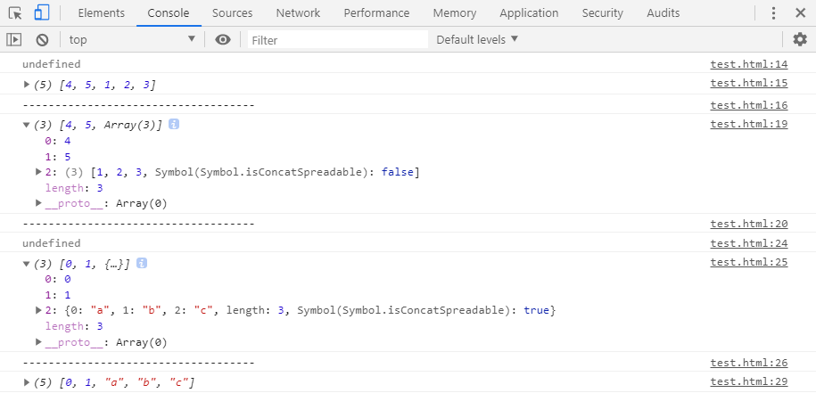

# L-11 Symbol类型
## 概述
> 在ES5中的对象属性名都是字符串，这很容易造成**属性名的冲突和覆盖**。如果有一种机制，保证每个属性的名字都是独一无二的就好了，这样就从根本上防止属性名的冲突。这就是ES6引入**Symbol**的原因。
> ES6引入了一种新的原始数据类型`Symbol`，表示独一无二的值。它是JavaScript语言继`undefined`、`null`、`Boolean`、`String`、`Number`和`Object`之后的**第七种基本数据类型**。
## 定义Symbol类型
| 语法 | 参数 |
| ---- | ---- |
| Symbol([description]) | description：可选参数，Symbol的描述，可用于调试但不能访问自身 |
* 可以直接使用`Symbol`方法创建新的`symbol`类型数据，如下：
```js
let s = Symbol();
console.log(typeof s);          //symbol
console.log(s);                 //Symbol()
```
* 也可以向`Symbol`方法中传入**String类型数据**作为描述符，如下：
```js
let s = Symbol('123');
console.log(typeof s);          //symbol
console.log(s);                 //Symbol(123)
```
* `Symbol`方法可接受其他**6种基本数据类型**参数作为描述符，如下：
```js
console.log(Symbol(123));
console.log(Symbol('123'));
console.log(Symbol(true));
console.log(Symbol(undefined));
console.log(Symbol(null));
console.log(Symbol({}));
```

* 创建出来的`symbol`数据看似相同，但是实际上都是独立的一个**新的symbol类型数据**，如下：
```js
console.log(Symbol('123') === Symbol('123'));
console.log(Symbol(123) === Symbol(123));
console.log(Symbol(true) === Symbol(true));
console.log(Symbol(undefined) === Symbol(undefined));
console.log(Symbol(null) === Symbol(null));
console.log(Symbol({}) === Symbol({}));
```

* 除了`String`类型的数据之外，当使用其他几种类型数据作为`Symbol`方法的描述符时，会先调用其自身或原型上的`toString`方法。将其转换为`String`类型，再作为`Symbol`方法的描述符创建`symbol`数据。如下示例：
```js
var obj = {
    toString : function () {
        return 'abc';
    }
}
let s = Symbol(obj);
console.log(s);                 // Symbol(abc)
```
* 当使用`symbol`数据作为`Symbol`方法的描述符时，会抛出`TypeError`。如下：
```js
console.log(Symbol(Symbol()));
```

* `symbol`数据不能与其他类型的值进行运算，会报错。如下：
```js
let s = Symbol('abc');
"I am " + s;                // Uncaught TypeError: Cannot convert a Symbol value to a string
`I am ${s}`;                // Uncaught TypeError: Cannot convert a Symbol value to a string
```
* `symbol`数据可以显式转为`String`类型，如下：
```js
let s = Symbol('abc');
console.log(s);
console.log(s.toString(s));
console.log(String(s));
```

* `symbol`数据也可以转化为`Boolean`类型，但是不能转化为`Number`类型。如下：
```js
let s = Symbol('abc');
console.log(Boolean(s));    // true
console.log(!s);            //false

console.log(Number(s));     // Uncaught TypeError: Cannot convert a Symbol value to a number
console.log(s + 2);         // Uncaught TypeError: Cannot convert a Symbol value to a number
```
## 不能使用new关键字创建symbol数据
> 在使用**new关键字**创建`symbol`数据时，会抛出错误，如下：
```js
let s = new Symbol();
```

> 在JavaScript中，`String`、`Number`和`Boolean`这几种基本数据类型都可以通过**new关键字**创建，如下：
```js
console.log(new String('123'));
console.log(new Number(123));
console.log(new Boolean(1));
```

### * 为何Symbol不能使用new关键字实例化？
> 因为这会创建一个**显式的Symbol包装器对象**，而不是一个`symbol`值。围绕原始数据类型创建显示包装器对象的做法，从`ECMAScript2015`开始就不再被支持。但是现有的原始包装器对象：如`new Number()`、`new String()`以及`new Boolean()`等都因为历史遗留问题仍可使用。
### * 创建Symbol包装器对象
> 如果仍想创建一个**Symbol包装器对象**，可以使用`Object`方法创建。如下：
```js
let sym = Symbol();
console.log(sym);
var symObj = Object(sym);
console.log(symObj);
console.log(new Number('123'));
```

## Symbol属性名
> 由于每一个Symbol值都是不相等的，这意味着symbol数据可以作为标识符，用于对象的属性名，就能保证不会出现同名的属性。这对于一个对象由多个模块构成的情况非常有用，能防止某一个键被不小心改写或覆盖。
### * symbol数据作为对象属性名时，不能使用点运算符
> 因为点运算符后面跟着的是字符串，所以不会读取变量指向的那个symbol数据。导致属性名实际上是一个字符串，而不是一个symbol数据。如下：
```js
let sym = Symbol();
let obj = {};
obj.sym = 123;
console.log(obj[sym]);          // undefined
console.log(obj['sym']);        // 123
```
### * 通过Object.defineProperty方法定义
```js
let sym = Symbol();
let obj = {};
Object.defineProperty(obj, sym, {value : 'symbol'});
console.log(obj);
```

### * 通过方括号定义对象的Symbol属性
> 在显式定义的对象中，定义Symbol属性必须使用方括号。如下：
```js
let sym = Symbol();
let obj1 = {};
obj1[sym] = 123;
let obj2 = {
    [sym] : 'abc'
};
console.log(obj1);
console.log(obj2);
```

## Symbol属性
> 下面很多内容来源于阮一峰的《ECMAScript 6 入门》，在Symbol上卡了两个星期，实在编不下去了。后面补充完整。
### * Symbol.prototype.description
> 返回symbol数据的描述符
```js
let sym = Symbol('abc');
console.log(sym.description);           // abc
```
### * Symbol.hasInstance
> 对象的Symbol.hasInstance属性，指向对象的一个内部方法。当其他对象使用instanceof运算符2时，会调用这个方法。如下：
```js
class Test {
    [Symbol.hasInstance](param){
        console.log(1);
        return false;
    }
};
console.log('abc' instanceof new Test());
var test = new Test();
console.log(typeof test[Symbol.hasInstance]);
```

### * Symbol.isConcatSpreadable
> 对象的Symbol.isConcatSpreadable属性等于一个布尔值，表示该对象用于`Array.prototype.concat()`时，是否可以展开。
```js
// 数组进行concat合并时的默认行为是展开的，它的isConcatSpreadable默认为undefined。
let arr = [1, 2, 3];
console.log(arr[Symbol.isConcatSpreadable]);
console.log([4, 5].concat(arr));
console.log('------------------------------------');
// 当数组的Symbol.isConcatSpreadable属性被设置为false时，数组在进行concat合并时，则不展开。
arr[Symbol.isConcatSpreadable] = false;
console.log([4, 5].concat(arr));
console.log('------------------------------------');

// 而类似数组的对象则相反，默认不展开。
let obj = {length : 3, 0 : 'a', 1 : 'b', 2 : 'c'};
console.log(obj[Symbol.isConcatSpreadable]);
console.log([0, 1].concat(obj));
console.log('------------------------------------');
// 当对象的Symbol.isConcatSpreadable属性设置为true时，它在进行concat合并时，是可以展开的。
obj[Symbol.isConcatSpreadable] = true;
console.log([0, 1].concat(obj));
```

> Symbol.isConcatSpreadable属性也可以定义在类里面：
```js
class A1 extends Array{
    constructor(args){
        super(args);
        // 定义在实例上
        this[Symbol.isConcatSpreadable] = true;
    }
}
class A2 extends Array{
    constructor(args){
        super(args);
    }
    // 定义在类本身
    get [Symbol.isConcatSpreadable]() {
        return false;
    }
}
let a1 = new A1();
a1[0] = 3;
a1[1] = 4;
let a2 = new A2();
a2[0] = 5;
a2[1] = 6;
console.log([1, 2].concat(a1).concat(a2));
```

### * Symbol.species
> 对象的Symbol.species属性，指向一个构造函数。创建衍生对象时，会使用该属性。
```js
class MyArray extends Array {
}

const a = new MyArray(1, 2, 3);
const b = a.map(x => x);
const c = a.filter(x => x > 1);

b instanceof MyArray // true
c instanceof MyArray // true
// 上面代码中，子类MyArray继承了父类Array，a是MyArray的实例，b和c是a的衍生对象。
// 你可能会认为，b和c都是调用数组方法生成的，所以应该是数组（Array的实例），但实际上它们也是MyArray的实例。
```
> Symbol.species属性就是为了解决这个问题而提供的。现在，我们可以为MyArray设置Symbol.species属性。
```js
class MyArray extends Array {
    // Symbol.species属性的固定写法，必须使用static关键字和get取值器
    static get [Symbol.species]() {
        return Array;
    }
}
let arr = new MyArray(1, 2, 3);
let a = arr.map(x => x);
let b = arr.filter(x => x > 1);
console.log(a instanceof MyArray);      // false
console.log(a instanceof Array);        // true
console.log(b instanceof MyArray);      // false
console.log(b instanceof Array);        // true
```
> 对象中默认的Symbol.speicies属性等同于下面的写法
```js
class obj extends xxxxx{
    static get [Symbol.species](){
        return this;
    }
}
```
> Symbol.species的作用在于，实例对象在运行过程中，需要再次调用自身的构造函数时，会调用该属性指定的构造函数。它主要的用途是，有些类库是在基类的基础上修改的，那么子类使用继承的方法时，作者可能希望返回基类的实例，而不是子类的实例。
### * Symbol.match
> 对象的Symbol.match属性，指向一个函数。当执行str.match(Object)时，如果该属性存在，会调用它，并返回该方法的返回值。
```js
String.prototype.match(regexp)
// 等同于
regexp[Symbol.match](this)

class MyMatcher {
    [Symbol.match](string) {
        return 'hello world'.indexOf(string);
    }
}

'e'.match(new MyMatcher()) // 1
```
### * Symbol.replace
> 对象的Symbol.replace属性，指向一个方法，当该对象被String.prototype.replace方法调用时，会返回该方法的返回值。
```js
String.prototype.replace(searchValue, replaceValue)
// 等同于
searchValue[Symbol.replace](this, replaceValue)
```
> Symbol.replace方法会收到两个参数，第一个参数是replace方法正在作用的对象，上面例子是Hello，第二个参数是替换后的值，上面例子是World。
```js
const x = {};
x[Symbol.replace] = (...s) => console.log(s);

'Hello'.replace(x, 'World') // ["Hello", "World"]
```
### * Symbol.search
> 对象的Symbol.search属性，指向一个方法，当该对象被String.prototype.search方法调用时，会返回该方法的返回值。
```js
String.prototype.search(regexp)
// 等同于
regexp[Symbol.search](this)

class MySearch {
    constructor(value) {
        this.value = value;
    }
    [Symbol.search](string) {
        return string.indexOf(this.value);
    }
}
'foobar'.search(new MySearch('foo')) // 0
```
### * Symbol.split
> 对象的Symbol.split属性，指向一个方法，当该对象被String.prototype.split方法调用时，会返回该方法的返回值。
```js
String.prototype.split(separator, limit)
// 等同于
separator[Symbol.split](this, limit)
```
> 下面方法使用Symbol.split方法，重新定义了字符串对象的split方法的行为
```js
class MySplitter {
    constructor(value) {
        this.value = value;
    }
    [Symbol.split](string) {
        let index = string.indexOf(this.value);
        if (index === -1) {
            return string;
        }
        return [
            string.substr(0, index),
            string.substr(index + this.value.length)
        ];
    }
}

'foobar'.split(new MySplitter('foo'))
// ['', 'bar']

'foobar'.split(new MySplitter('bar'))
// ['foo', '']

'foobar'.split(new MySplitter('baz'))
// 'foobar'
```
### * Symbol.iterator
> 对象的Symbol.iterator属性，指向该对象的默认遍历器方法。
```js
const myIterable = {};
myIterable[Symbol.iterator] = function* () {
    yield 1;
    yield 2;
    yield 3;
};

[...myIterable] // [1, 2, 3]
```
> 对象进行for...of循环时，会调用Symbol.iterator方法，返回该对象的默认遍历器。
```js
class Collection {
    *[Symbol.iterator]() {
        let i = 0;
        while(this[i] !== undefined) {
            yield this[i];
            ++i;
        }
    }
}

let myCollection = new Collection();
myCollection[0] = 1;
myCollection[1] = 2;

for(let value of myCollection) {
    console.log(value);
}
// 1
// 2
```
### * Symbol.toPrimitive
> 对象的Symbol.toPrimitive属性，指向一个方法。该对象被转为原始类型的值时，会调用这个方法，返回该对象对应的原始类型值。
> Symbol.toPrimitive被调用时，会接受一个字符串参数，表示当前运算的模式，一共有三种模式：
> * Number：该场合需要转成数值
> * String：该场合需要转成字符串
> * Default：该场合可以转成数值，也可以转成字符串
```js
let obj = {
    [Symbol.toPrimitive](hint) {
        switch (hint) {
        case 'number':
            return 123;
        case 'string':
            return 'str';
        case 'default':
            return 'default';
        default:
            throw new Error();
        }
    }
};

2 * obj // 246
3 + obj // '3default'
obj == 'default' // true
String(obj) // 'str'
```
### * Symbol.toStringTag
> 对象的Symbol.toStringTag属性，指向一个方法。在该对象上面调用Object.prototype.toString方法时，如果这个属性存在，它的返回值会出现在toString方法返回的字符串之中，表示对象的类型。也就是说，这个属性可以用来定制[object Object]或[object Array]中object后面的那个字符串。
```js
// 例一
({[Symbol.toStringTag]: 'Foo'}.toString())
// "[object Foo]"

// 例二
class Collection {
    get [Symbol.toStringTag]() {
        return 'xxx';
    }
}
let x = new Collection();
Object.prototype.toString.call(x) // "[object xxx]"
```
> ES6 新增内置对象的Symbol.toStringTag属性值如下。
> * JSON[Symbol.toStringTag]：'JSON'
> * Math[Symbol.toStringTag]：'Math'
> * Module 对象M[Symbol.toStringTag]：'Module'
> * ArrayBuffer.prototype[Symbol.toStringTag]：'ArrayBuffer'
> * DataView.prototype[Symbol.toStringTag]：'DataView'
> * Map.prototype[Symbol.toStringTag]：'Map'
> * Promise.prototype[Symbol.toStringTag]：'Promise'
> * Set.prototype[Symbol.toStringTag]：'Set'
> * %TypedArray%.prototype[Symbol.toStringTag]：'Uint8Array'等
> * WeakMap.prototype[Symbol.toStringTag]：'WeakMap'
> * WeakSet.prototype[Symbol.toStringTag]：'WeakSet'
> * %MapIteratorPrototype%[Symbol.toStringTag]：'Map Iterator'
> * %SetIteratorPrototype%[Symbol.toStringTag]：'Set Iterator'
> * %StringIteratorPrototype%[Symbol.toStringTag]：'String Iterator'
> * Symbol.prototype[Symbol.toStringTag]：'Symbol'
> * Generator.prototype[Symbol.toStringTag]：'Generator'
> * GeneratorFunction.prototype[Symbol.toStringTag]：'GeneratorFunction'
### * Symbol.unscopables
> 对象的Symbol.unscopables属性，指向一个对象。该对象指定了使用with关键字时，哪些属性会被with环境排除。
```js
Array.prototype[Symbol.unscopables]
// {
//   copyWithin: true,
//   entries: true,
//   fill: true,
//   find: true,
//   findIndex: true,
//   includes: true,
//   keys: true
// }

Object.keys(Array.prototype[Symbol.unscopables])
// ['copyWithin', 'entries', 'fill', 'find', 'findIndex', 'includes', 'keys']
```
> 上面代码说明，数组有 7 个属性，会被with命令排除。
```js
// 没有 unscopables 时
class MyClass {
    foo() { return 1; }
}

var foo = function () { return 2; };
with (MyClass.prototype) {
    foo(); // 1
}

// 有 unscopables 时
class MyClass {
    foo() { return 1; }
    get [Symbol.unscopables]() {
        return { foo: true };
    }
}

var foo = function () { return 2; };
with (MyClass.prototype) {
    foo(); // 2
}
```
> 上面代码通过指定Symbol.unscopables属性，使得with语法块不会在当前作用域寻找foo属性，即foo将指向外层作用域的变量。
## Symbol静态方法
### * Symbol.for
> 有时，我们希望重新使用同一个Symbol值，Symbol.for方法可以做到这一点。它接受一个字符串作为参数，然后搜索有没有以该参数作为名称的Symbol值。如果有，就返回这个Symbol值，否则就新建并返回一个以该字符串为名称的Symbol值。
```js
Symbol.for("bar") === Symbol.for("bar")
// true

Symbol("bar") === Symbol("bar")
// false
```
> 上面代码中，由于Symbol()写法没有登记机制，所以每次调用都会返回一个不同的值。
### * Symbol.keyFor
> Symbol.keyFor方法返回一个已登记的 Symbol 类型值的key。
```js
let s1 = Symbol.for("foo");
Symbol.keyFor(s1) // "foo"

let s2 = Symbol("foo");
Symbol.keyFor(s2) // undefined
```
> 上面代码中，变量s2属于未登记的Symbol值，所以返回undefined。需要注意的是，Symbol.for为Symbol值登记的名字，是全局环境的，可以在不同的iframe或service worker中取到同一个值。
```js
iframe = document.createElement('iframe');
iframe.src = String(window.location);
document.body.appendChild(iframe);

iframe.contentWindow.Symbol.for('foo') === Symbol.for('foo')
// true
```
> 上面代码中，iframe 窗口生成的 Symbol 值，可以在主页面得到。