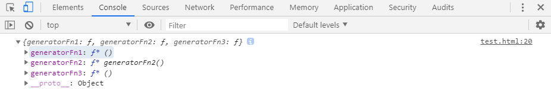

# L-12 Generator生成器
**`Generator`函数**是`ES6`提供的一种异步编程解决方案，语法行为与传统函数完全不同。
## 协程与生成器的关系
传统的编程语言，早有异步编程的解决方案（其实是多任务的解决方案）。其中有一种叫做**协程**（`coroutine`），意思是多个线程互相协作，完成异步任务。**协程有点像函数，又有点像线程。**它的运行流程大致如下。
```js
// 第一步，协程A开始执行。

// 第二步，协程A执行到一半，进入暂停，执行权转移到协程B。

// 第三步，（一段时间后）协程B交还执行权。

// 第四步，协程A恢复执行。
```
上面流程的协程A，就是异步任务，因为它分成两段（或多段）执行。举例来说，读取文件的协程写法如下。
```js
function asnycJob() {
  // ...其他代码
  var f = yield readFile(fileA);
  // ...其他代码
}
```
上面代码的函数`asyncJob`是一个协程，它的奥妙就在其中的**`yield`命令**。它表示执行到此处，执行权将交给其他协程。也就是说，**`yield`命令**是异步两个阶段的分界线。
协程遇到**`yield`命令**就暂停，等到执行权返回，再从暂停的地方继续往后执行。**它的最大优点，就是代码的写法非常像同步操作。**如果去除**`yield`命令**，简直一模一样。
## Generator函数
**`Generator`函数**是`ES6`中**协程的半实现**，是`ES6`中处理异步的一种方式。**`Generator`函数**有多种理解角度。
* 语法上，首先可以把它理解成，**`Generator`函数是一个状态机**，封装了多个内部状态。
* **执行Generator函数会返回一个遍历器对象**，也就是说，Generator函数除了状态机，还是一个遍历器对象生成函数。返回的遍历器对象，可以依次遍历Generator函数内部的每一个状态。
* **形式上，Generator函数是一个普通函数，但是有两个特征**。一是，function关键字与函数名之间有一个星号；二是，函数体内部使用yield表达式，定义不同的内部状态（yield在英语里的意思就是“产出”）。

### Generator函数声明
**`Generator`函数**的声明和简单，在**function**和**函数名**之间，有个`*`作为**`Generator`函数**声明的标志。如下：
```js
function* fn(){};
```
但是在`ES6`中，没有明确规定声明**`Generator`函数**的`*`必须固定在什么位置，所以以下几种情况，都是没有语法错误的：
```js
function*fn(){};
function* fn(){};
function *fn(){};
function * fn(){};
```
### 声明对象中的Generator方法
如果一个对象的属性是**`Generator`函数**，可以有以下几种声明方式：
```js
let obj = {
    // 直接声明：
    generatorFn1 : function* () {},
    // 简写声明：
    *generatorFn2(){}
}
// 对象外部声明
obj.generatorFn3 = function* () {};
console.log(obj);
```

### yield表达式
由于**`Generator`函数**返回的遍历器对象，只有调用**next方法**才会遍历下一个内部状态，所以其实提供了一种可以暂停执行的函数。**`yield`表达式就是暂停标志**。
遍历器对象的next方法的运行逻辑如下：
* 遇到**`yield`表达式**，就暂停执行后面的操作，并将紧跟在`yield`后面的那个表达式的值，作为返回的对象的value属性值。
* 下一次调用**next方法**时，再继续往下执行，直到遇到下一个**`yield`表达式**。
* 如果没有再遇到新的**`yield`表达式**，就一直运行到函数结束，直到**return语句**为止，并将**return语句**后面的表达式的值，作为返回的对象的`value`属性值。
* 如果该函数结尾没有**return语句**，则返回的对象的`value`属性值为`undefined`。
需要注意的是，**`yield`表达式**后面的表达式，只有当调用**next方法**、内部指针指向该语句时才会执行，因此等于为 JavaScript提供了手动的**惰性求值**（`Lazy Evaluation`）的语法功能。