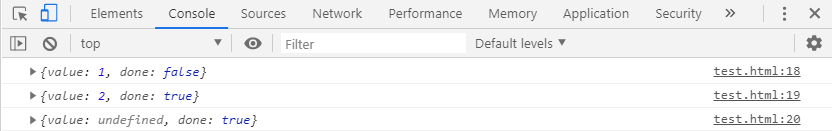

# L-12 Generator生成器
> `Generator`函数是`ES6`提供的一种异步编程解决方案，语法行为与传统函数完全不同。
## 协程与生成器的关系
> 传统的编程语言，早有异步编程的解决方案（其实是多任务的解决方案）。其中有一种叫做**协程**（`coroutine`），意思是多个线程互相协作，完成异步任务。**协程有点像函数，又有点像线程。**它的运行流程大致如下。
```js
// 第一步，协程A开始执行。

// 第二步，协程A执行到一半，进入暂停，执行权转移到协程B。

// 第三步，（一段时间后）协程B交还执行权。

// 第四步，协程A恢复执行。
```
> 上面流程的协程A，就是异步任务，因为它分成两段（或多段）执行。举例来说，读取文件的协程写法如下。
```js
function asnycJob() {
  // ...其他代码
  var f = yield readFile(fileA);
  // ...其他代码
}
```
> 上面代码的函数`asyncJob`是一个协程，它的奥妙就在其中的`yield命令`。它表示执行到此处，执行权将交给其他协程。也就是说，`yield命令`是异步两个阶段的分界线。
> 协程遇到`yield命令`就暂停，等到执行权返回，再从暂停的地方继续往后执行。**它的最大优点，就是代码的写法非常像同步操作。**如果去除`yield命令`，简直一模一样。
## Generator函数
> `Generator`函数是`ES6`中**协程的半实现**，是`ES6`中处理异步的一种方式。`Generator`函数有多种理解角度。
* 语法上，首先可以把它理解成，**Generator函数是一个状态机**，封装了多个内部状态。
* **执行Generator函数会返回一个遍历器对象**，也就是说，Generator函数除了状态机，还是一个遍历器对象生成函数。返回的遍历器对象，可以依次遍历Generator函数内部的每一个状态。
* **形式上，Generator函数是一个普通函数，但是有两个特征**。一是，function关键字与函数名之间有一个星号；二是，函数体内部使用yield表达式，定义不同的内部状态（yield在英语里的意思就是“产出”）。

### Generator函数声明
> `Generator`函数的声明和简单，在`function`和`函数名`之间，有个`*`作为`Generator`函数声明的标志。如下：
```js
function* fn(){};
```
> 但是在`ES6`中，没有明确规定声明`Generator`函数的`*`必须固定在什么位置，所以以下几种情况，都是没有语法错误的：
```js
function*fn(){};
function* fn(){};
function *fn(){};
function * fn(){};
```
### 声明对象中的Generator方法
> 如果一个对象的属性是`Generator`函数，可以有以下几种声明方式：
```js
let obj = {
    // 直接声明：
    generatorFn1 : function* () {},
    // 简写声明：
    *generatorFn2(){}
}
// 对象外部声明
obj.generatorFn3 = function* () {};
console.log(obj);
```

### yield表达式
> 由于`Generator`函数返回的遍历器对象，只有调用`next`方法才会遍历下一个内部状态，所以其实提供了一种可以暂停执行的函数。**yield表达式就是暂停标志**。
> 遍历器对象的`next`方法的运行逻辑如下：
> * 遇到`yield`表达式，就暂停执行后面的操作，并将紧跟在`yield`后面的那个表达式的值，作为返回的对象的value属性值。
> * 下一次调用`next`方法时，再继续往下执行，直到遇到下一个`yield`表达式。
> * 如果没有再遇到新的`yield`表达式，就一直运行到函数结束，直到`return`语句为止，并将`return`语句后面的表达式的值，作为返回的对象的`value`属性值。
> * 如果该函数结尾没有`return`语句，则返回的对象的`value`属性值为`undefined`。
> 需要注意的是，`yield`表达式后面的表达式，只有当调用`next`方法、内部指针指向该语句时才会执行，因此等于为 JavaScript提供了手动的**惰性求值**（`Lazy Evaluation`）的语法功能。
```js
function * fn(n1, n2) {
    yield n1 + n2;
}
let f = fn(1, 2);
console.log(f);
console.log(f.next());
```
> 上面代码的结果如下：当调用fn函数时，返回的是一个暂停状态的生成器函数。当使用next方法时，函数内部的指针指向yield语句，返回计算的结果。


> Generator函数可以不用yield表达式，这时就变成一个单纯的暂缓执行函数。
```js
function* f() {
    console.log('执行了！');
}

var generator = f();

setTimeout(function () {
    generator.next();
}, 2000);
console.log('脚本执行结束');
```

### yield与return的区别
> yield表达式与return语句既有相似之处，也有区别。相似之处在于，都能返回紧跟在语句后面的表达式的值。区别之处：
> * 每次遇到yield，函数暂停执行，下一次再从该位置继续向后执行。而return语句不具备位置记忆的功能。
> * 一个函数内部，只能执行一次return语句。但是可以执行多次yield表达式。
> * 正常函数只能返回一个值，因为只能执行一次return。Generator（生成器）函数可以返回一些列的值，以为可以有任意多个yield。也就是说Generator（生成器）函数生成一系列的值，这也就是它的名称的来历。
> 需要注意的是：当yield表达式处于return语句之后，当next方法执行到return语句之后，再次调用next方法不会再往下执行，返回`{value: undefined, done: true}`。如下：
```js
function * fn() {
    yield 1;
    return 2;
    yield 3;
}
let f = fn();
console.log(f.next());
console.log(f.next());
console.log(f.next());
```


> yield表达式只能用在Generator函数里面，用在其他地方会报错。如下：
```js
(function () {
    yield 1;
})();
```

> 第二个例子：由于Generator函数内部中，foreach的参数也是一个普通函数，当foreach中出现yield表达式时，就会报错。
```js
function * fn(arr) {
    arr.forEach(e => {
        yield e;
    });
}
console.log(fn([1, 2, 3]).next());
```

> 第三个例子：yield表达式如果用在另一个表达式中，必须放在圆括号里面。
```js
function* fn() {
    // console.log('Hello' + yield);    // SyntaxError
    // console.log('Hello' + yield 123);// SyntaxError

    console.log('Hello' + (yield));     // Helloundefined
    console.log('Hello' + (yield 123)); // Helloundefined
}
let f = fn();
f.next();
```
> yield表达式用作函数参数放在赋值表达式右边，可以不加括号。
```js
function * fn() {
    let arg = yield;
}
```
## Generator生成器与Iterator接口的关系
> 由于 Generator 函数就是遍历器生成函数，因此可以把 Generator 赋值给对象的Symbol.iterator属性，从而使得该对象具有 Iterator 接口。
```js
var myIterable = {};
myIterable[Symbol.iterator] = function* () {
    yield 1;
    yield 2;
    yield 3;
};
console.log([...myIterable]);
```
上面代码中，Generator 函数赋值给Symbol.iterator属性，从而使得myIterable对象具有了 Iterator 接口，可以被...运算符遍历了。

> Generator 函数执行后，返回一个遍历器对象。该对象本身也具有Symbol.iterator属性，执行后返回自身。
```js
function* gen(){
  // some code
}
var g = gen();
console.log(g[Symbol.iterator]() === g);
```
上面代码中，gen是一个 Generator 函数，调用它会生成一个遍历器对象g。它的Symbol.iterator属性，也是一个遍历器对象生成函数，执行后返回它自己。

## next方法的参数
> yield关键字本身没有返回值，它只返回跟在它后面的变量或表达式的值。当变量没有值或yield后面没有任何变量或表达式时，返回的值为undefined。
> next方法可以传递一个参数，该参数会被当做上一个yield表达式的返回值。
```js
function * fn(x) {
    var y = yield(1 + 1);
    yield y;
    var z = yield (x - 1);
    yield z;
}
let f = fn(5);
console.log(f.next());
console.log(f.next(12));
console.log(f.next(1));
console.log(f.next(1));
```
> 执行流程：
> * 第一次执行next方法时，返回第一个yield表达式的值：2。
> * 第二次执行next方法时，由于next方法中传入的12被当做第一个yield表达式的值，即变量y等于12。所以第二个yield表达式返回y的值：12。
> * 第三次执行next方法时，next方法传入1。上一个yield y表达式值为1，但是在当前指向的yield表达式的结果是fn(5)传入的x值加1，返回4。
> * 第四次执行next方法时，由于next方法中传入的1被当做上一个yield表达式的值，即变量z等于1。所以第四个yield表达式返回z的值：1。

> 注意：由于next方法传入的参数表示上一个yield表达式的返回值，所以第一次调用next方法时，传递参数是无效的。V8引擎直接忽略第一次调用next方法的参数，只有从第二次使用next方法开始，参数才是有效的。
> 从语义上讲，第一个next方法用来启动遍历器对象，所以不用带有参数。
> **如果想要第一次调用next方法时，就能够传入参数并生效，则需要在Generator函数外面再包装一层：**
```js
function * fn(x) {
    var y = yield(1 + 1);
    yield y;
    var z = yield (x - 1);
    yield z;
}
function wrapper() {
    let f = fn(5);
    f.next();
    return f;
}
console.log(wrapper().next(12));
console.log(wrapper().next(1));
console.log(wrapper().next(1));
```
> 如上面代码中，定义一个wrapper函数。在wrapper函数中调用Generator函数，并调用next方法启动遍历器对象，再将产生的遍历器对象返回出去。所以在使用wrapper函数返回的遍历器对象时，首次调用next方法可以传递参数并生效。