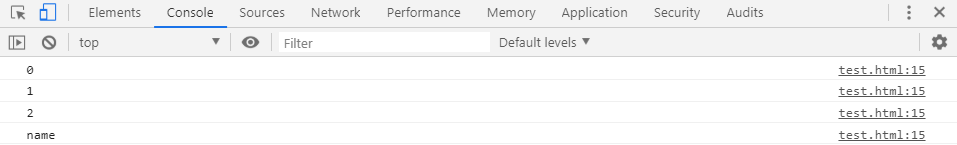
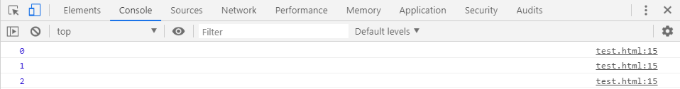
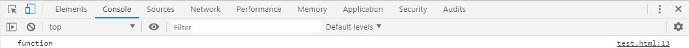
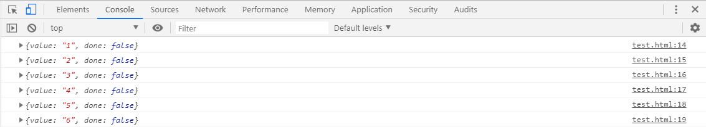
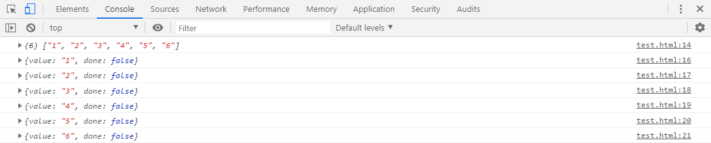
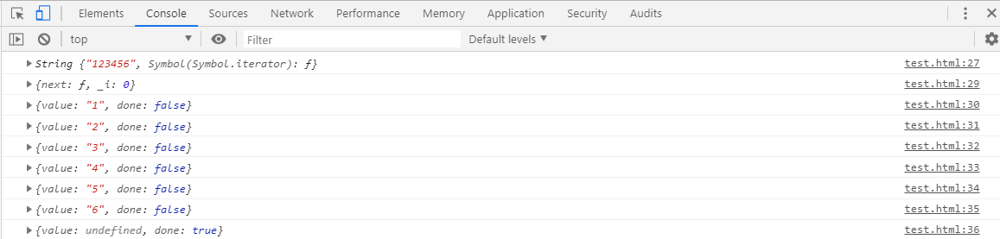
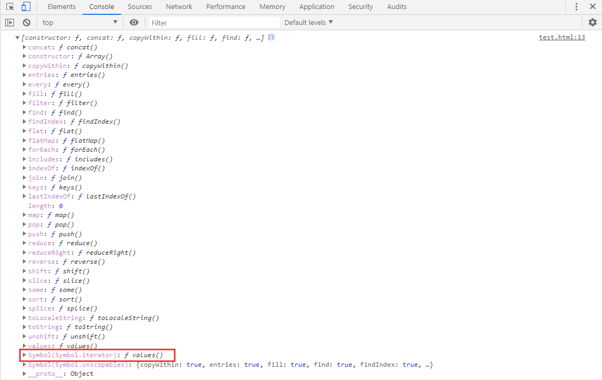
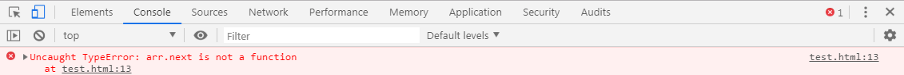
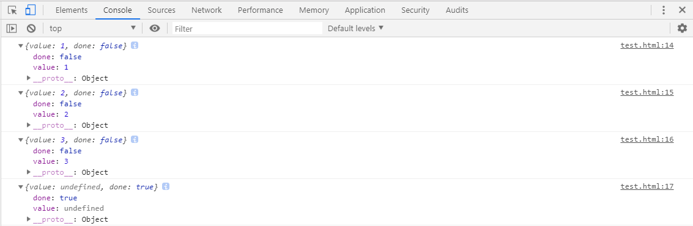

# L-10 迭代协议
> ECMAScript 2015的几个补充，并不是新的内置实现和语法，而是协议，这些协议可以被任何遵循某些约定的对象来实现。
>
> 有两个协议：**`可迭代协议`**和**`迭代器协议`**。
## Iterable protocols可迭代协议
> **`iterable`**是ES6标准新引入的新的协议，`Array`、`Map`和`Set`都属于**`iterable可迭代协议的实现`**，属于`可迭代对象`。
### * 为什么加入iterable协议？
> **`iterable可迭代协议`**允许JavaScript对象去定义或定制它们的迭代行为，例如：在一个`for...of`结构中什么值可以被循环（得到）。一些内置类型都是内置的可迭代类型并且有默认的迭代行为，比如`Array`或`Map`。另一些类型则不是，比如`Object`。
* 遍历`Array`是可以使用下标循环，而遍历`Map`或`Set`时无法使用下标。集合类型不统一。
* 对`Array`使用`for..in`循环，当添加额外的属性后，会有意外效果。
```js
let a = [1, 2, 3];
a.name = 4;
for (let i in a) {
    console.log(i);
}
```

* 因此，ES6统一了**集合 or 对象**的遍历方式`for...of`。用于替代`for...in`和`forEach`，它能很好的支持迭代协议。
```js
let a = [1, 2, 3];
a.name = 4;
for (let k of a.keys()) {
    console.log(k);
}
```

### * 如何实现可迭代对象？
* 要使一个对象变成可迭代对象，一个对象必须实现**`@@iterator`**方法。
* 意思是这个对象（或者对象原型链上的某个对象）必须有一个名字是**`Symbol.iterator`**的属性。
* 当一个对象需要被迭代时，它的**`@@iterator`**方法被调用且无参数。然后返回一个用于在迭代中获取值的迭代器。

| 属性 | 值 |
| ---- | ---- |
| `[Symbol.iterator]` | 返回一个对象的无参函数，被返回对象符合迭代器协议 |
### iterator protocols迭代器协议
> iterator协议定义了一种标准的方式来产生一个有限或无限序列的值，并且但所有的值都已经被迭代后，就会有一个默认的返回值。
> 只有满足以下条件的一个对象才会被认为是一个迭代器：
* 它实现了一个`next()`方法用于对**可迭代对象的指针**进行迭代，获取迭代后指向的值。
* `next()`方法是返回一个对象的无参函数，且返回对象拥有两个属性：

| 属性 | 值 |
| ---- | ---- |
| `done` | 迭代器已经超过了可迭代次数返回`true`<br>如果迭代器可以产生序列中的下一个值，则为`false` |
| `value` | 迭代器返回的任何值。当`done`的值为`true`忽略 |
* `next()`方法如果返回一个非对象值，会展示一个`TypeError`错误。
## 使用迭代协议的例子
### * 内置的可迭代对象
> 例如String是一个内建的可迭代对象：
```js
let str = '123456';
console.log(typeof str[Symbol.iterator]);
```

### * String的迭代行为
> String的默认迭代器会一个接一个返回该字符串的单个字符：
```js
let str = '123456';
let s = str[Symbol.iterator]();     // 调用自身或原型链上的@@iterator方法，生成迭代器
console.log(s.next());
console.log(s.next());
console.log(s.next());
console.log(s.next());
console.log(s.next());
console.log(s.next());
```

### * 其他支持迭代协议的语法
> 一些内置的语法结构，比如扩展运算符...，其内部也使用了同样的迭代协议：
```js
let str = '123456';
let s = [...str];           // 扩展运算符，对字符串进行解构
console.log(s);
s = s[Symbol.iterator]();   // 调用自身或原型链上的@@iterator方法，生成迭代器
console.log(s.next());
console.log(s.next());
console.log(s.next());
console.log(s.next());
console.log(s.next());
console.log(s.next());
```

### * 自定义迭代行为
> 可以重写迭代对象的**`@@iterator`**方法实现自定义迭代行为，如下为模拟`String`的**`@@iterator`**方法：
```js
let str = new String('123456');
str[Symbol.iterator] = function () {
    return {
        next : function () {
            if (this._i >= str.length) {
                return { value: undefined, done: true };
            }else{
                var k = this._i;
                this._i++;
                return {value : str[k], done : false};
            }
        },
        _i : 0
    }
}
console.log(str);
let s = str[Symbol.iterator]();
console.log(s);
console.log(s.next());
console.log(s.next());
console.log(s.next());
console.log(s.next());
console.log(s.next());
console.log(s.next());
console.log(s.next());
```

## 可迭代对象示例
### * 内建的可迭代对象
> `String`、`Array`、`TypedArray`、`Map`和`Set`是JavaScript内置的可迭代对象，因为他们的原型对象都有一个**`@@iterator`**方法。
* 以下使用Array为例：
```js
let arr = [1, 2, 3];
console.log(arr.__proto__);
```

* 但是这些类型的数据并无法直接调用`next()`方法，如下：
```js
let arr = [1, 2, 3];
console.log(arr.next());
console.log(arr.next());
console.log(arr.next());
```

* 这些数据类型需要先调用自身（或原型链上）的**`@@iterator`**方法，通过返回的**迭代器**调用`next()`方法。如下：
```js
let arr = [1, 2, 3];
let a = arr[Symbol.iterator]();
console.log(a.next());
console.log(a.next());
console.log(a.next());
console.log(a.next());
```
