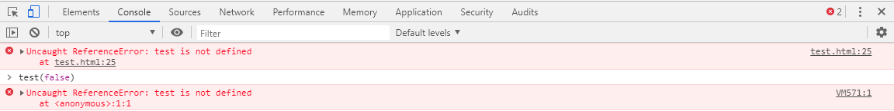

# 模块化
> 在ES6之前，JavaScript中并没有模块化的概念。社区中出现了CommonJS、AMD和CMD等JavaScript模块化的规范，而ES6自带了模块化（目前各个浏览器对ES6的支持程度不同，通常使用babel等构建工具将ES6转化为ES5的语法实现兼容）。
## 基本语法
> 在ES6中，模块代码需要导出（暴露）提供给外界访问的变量（或常量）。不同的导出方式，在引入此模块的JS代码中，有不同的接收方式。在使用**import**引入模块时，需要给**script标签**设置**type="module"**的属性，且无需使用外链的形式引入js模块文件。
* **只导出一个变量（或常量），可以使用`default`关键字：**
```js
// module-code（模块文件代码）:
export default 100;

// main-code（主文件代码）:
import a from './test.js';
console.log(a);             // 100
```
* **变量名/常量名 导出：**
```js
// module-code:
// export const num = 100;      // 导出常量
export let num = 100;           // 导出变量

// main-code:
import a from './test.js';
console.log(a);                 // SyntaxError
```
上面的代码执行结果如下：


> 上面错误指出模块中未提供名为'default'的导出，在导出固定名称的变量（或常量）时，在接收时需要使用{}包裹，否则视为接收模块中使用default导出的默认数据。如下：
```js
// module-code:
// export const num = 100;      // 导出常量
export let num = 100;           // 导出变量

// main-code:
import {a} from './test.js';
console.log(a);                 // SyntaxError
```

此时虽然依然会报错，但不是未提供名为'default'的导出。如下： 


> 上面错误指出模块中未提供名为'a'的导出，在导出具体变量（或常量）时，接收时需要与导出的变量名（或常量名）一致。如下：
```js
// module-code:
// export const num = 100;      // 导出常量
export let num = 100;           // 导出变量

// main-code:
import {num} from './test.js';
console.log(num);               // 100
```

* **导出/接收多个**
> 当导出多个指定名称的数据时，接收可以使用解构的方式接收
```js
// module-code:
export let a = 1;
export let b = 2;
export let c = 3;

// main-code:
import {a, b, c} from './test.js';
console.log(a, b, c);               // 1 2 3
```
* **default和多个导出/接收**
> 当使用default导出默认数据，并导出其他指定名称的数据时。例如以下代码，zero接收default数据，{}中的变量接收其他指定名称的数据：
```js
// module-code:
export default 0;
export let a = 1;
export let b = 2;
export let c = 3;

// main-code:
import zero,{a, b, c} from './test.js';
console.log(zero, a, b, c);         // 0 1 2 3
```
* **使用对象导出多个数据**
> 实际上，在导出指定名称的数据时，会将所有要导出的数据整合成一个对象，所以接收时可以使用对象的解构方式进行接收。
```js
// module-code:
let a = 1;
let b = 2;
let c = 3;
export {
    a,
    b,
    c
};

// main-code:
import {a, b, c} from './test.js';
console.log(a, b, c);               // 1 2 3
```
* **使用别名导出数据**
```js
// module-code:
let a = 0;
export {a as number};

// main-code:
import {number} from './test.js';
console.log(number);                // 0
```
* **使用*（通配符）重新导出其他模块的接口**
> 在模块中，可以引入其他模块。而且在当前模块中，可以使用*（通配符）重新导出引入模块的所有数据。
```js
// module-code:
// test2.js
export default 0;
export let a = 1;
export let b = 2;
export let c = 3;
// test.js
export * from './test2.js';

// main-code:
import * as obj from './test.js';
console.log(obj);
```


* **使用`*（通配符）`接收所有导出的数据**
> 可以使用`*（通配符）`接收模块中导出的所有数据，但是必须将接收到的数据赋给一个别名：
```js
// module-code:
export default 0;
export let a = 1;
export let b = 2;
export let c = 3;

// main-code:
import * as obj from './test.js';
console.log(obj);
```


## ES6模块化的规则和特点
1. 在使用import加载模块时，必须是在服务器环境下（无法本地文件直接访问）。

2. 在HTML页面中，使用import加载模块时，需要在当前JavaScript代码段的script标签加上type="module"
```html
<script type="module">
    // code...
</script>
```

3. 每个模块中定义的变量都是局部变量，不会污染到全局作用域。
```js
// module-code:
var i = 100;
export default 0;

// main-code:
import zero from './test.js';
console.log(i);
```


4. 模块中可以导入其他模块，并且可以将导入的模块数据再重新导出。
```js
// module-code:
// test2.js
export default 0;
export let a = 1;
export let b = 2;
export let c = 3;
// test.js
import zero from './test2.js';
console.log('test.js:', zero);
export default zero;

// main-code:
import zero from './test.js';
console.log('test.html:', zero);
```


5. 使用import导入模块时，模块中的代码会被执行。
```js
// module-code:
console.log('running');
let zero = 0;
export default zero;

// main-code:
import zero from './test.js';
```


6. 不论使用import导入多少次同一模块，这个模块只会被执行一次。
```js
// module-code:
console.log('running');
let zero = 0;
export default zero;
export let a = 1;

// main-code:
import zero from './test.js';
import {a} from './test.js';
```


7. 在if或for循环等代码块中使用import引入模块将会报错。
```js
// module-code:
let zero = 0;
export default zero;

// main-code:
if (true) {
    import zero from './test.js';
}
```


8. ES6也可以实现按需加载模块。
> import不仅是一个关键字，也是一个原生支持的一个方法，它是Promise的一个应用实现。而且这种加载模块的方式，不需要在script标签加上type="module"。
```js
// module-code:
// test2.js
export default 0;
console.log('I am test2.js');
// test.js
let zero = 0;
export default zero;
console.log('I am test.js');
```
```html
<script>
// main-code:
function test(arg) {
    if (arg) {
        import('./test.js').then(function (res) {
            console.log(res);
        });
    }else{
        import('./test2.js').then(function (res) {
            console.log(res);
        });
    }
}
</script>
```

9. 当在script标签中加上type="module"属性时，当前script标签中会变成其他script标签、以及浏览器控制台无法访问的一个特殊的作用域。
```html
<script type="module">
function test(arg) {
    if (arg) {
        import('./test.js').then(function (res) {
            console.log(res);
        });
    }else{
        import('./test2.js').then(function (res) {
            console.log(res);
        });
    }
}
</script>
<script>
test(true);
</script>
```
