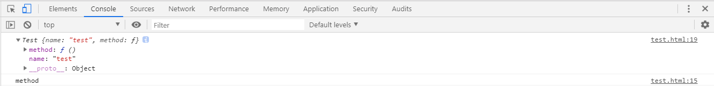
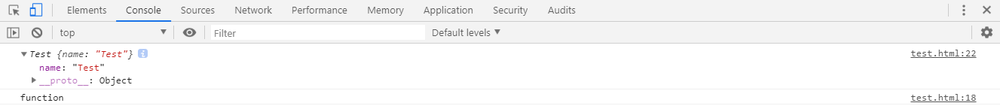
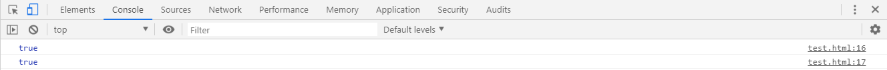
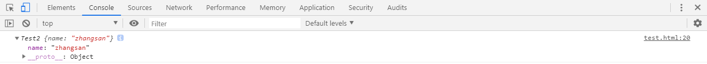
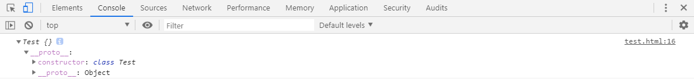
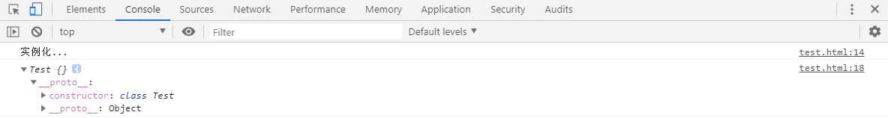
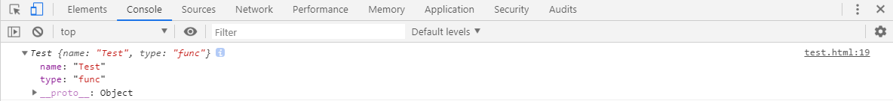
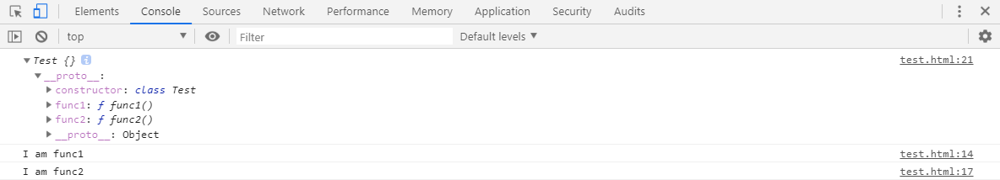
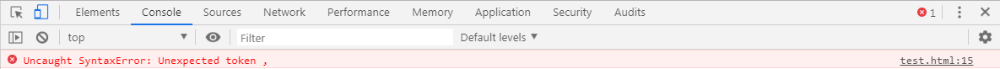
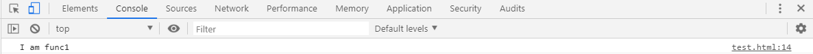

# L-9 类与继承
> JavaScript不像传统OO语言有class关键字，即JS没有类。因此JS为了取得类的复用啊，封装啊，继承啊等优点，出现了很多和构造函数相关的语法糖。ES6将语法糖标准化后，提供了class关键字来模拟定义类。class本质上也是一个语法糖，能让代码更简单易读。
## ES5中模拟的类与继承
1. ES6之前，在JavaScript中，可以使用构造函数来模拟其他语言中的类。
```js
function Test() {
    this.name = 'test';
    this.method = function () {
        console.log('method');
    }
}
var test = new Test();
console.log(test);
test.method();
```

2. 可以使用prototype属性添加构造函数的属性和方法。
```js
function Test() {
    this.name = 'Test';
}
Test.prototype = {
    type : 'function',
    method : function () {
        console.log(this.type);
    }
}
var test = new Test();
console.log(test);
test.method();
```

3. 判断对象是否是此构造函数的实例化。
```js
function Test() {
    this.name = 'Test';
}
var test = new Test();
// test对象的原型是否与Test构造函数的原型一致
console.log(test.__proto__ === Test.prototype);
// test的构造器是否与Test构造函数的构造器一致
console.log(test.constructor === Test.prototype.constructor);
```

4. 模拟继承
```js
function Test(name) {
    this.name = name;
}
function Test2(name) {
    // 改变当前构造函数的this指向，并将参数传递给继承的构造函数
    // Test.call(this, name);
    Test.apply(this, [name]);
    // 将this的原型指向Test构造函数的原型上
    this.__proto__ = Test.prototype;
}
// 对象t是Test2构造函数的实例化
var t = new Test2('zhangsan');
console.log(t);
// test对象的原型是否与Test构造函数的原型一致
console.log(t.__proto__ === Test.prototype);
// test的构造器是否与Test构造函数的构造器一致
console.log(t.constructor === Test.prototype.constructor);
```

## ES6的类和继承
> 在ES6中，对一些语法糖进行集成，其中就有**class（类）**和**extend（继承）**等关键字。
### `class`关键字定义类
```js
class Test{

}
let t = new Test();
console.log(t);
```

### 类中的构造方法
> * 在`class`关键字定义的类中，有个`constructor`方法。它是当前类中的构造方法，当使用`new`关键字实例化类时，会执行`constructor`方法中的代码。
```js
class Test{
    constructor (){
        console.log('实例化...');
    }
}
let t = new Test();
console.log(t);
```

> * 向类中传递参数，可以在构造方法中接收
```js
class Test{
    constructor (name, type){
        this.name = name;
        this.type = type
    }
}
let t = new Test('Test', 'func');
console.log(t);
```

### 定义类中的方法
```js
class Test {
    func1 (){
        console.log('I am func1');
    }
    func2 (){
        console.log('I am func2');
    }
}
let t = new Test();
console.log(t);
t.func1();
t.func2();
```

> * 在class定义的类中，方法间不可以使用`,`分隔，如果使用了将会报错。如下：
```js
class Test {
    func1 (){
        console.log('I am func1');
    },
    func2 (){
        console.log('I am func2');
    }
}
```

### 类的静态方法
> * ES6中也可以使用类调用其自身的方法，与很多语言类似，它也是使用`static`关键字定义类的静态方法。
```js
class Test {
    static func1 (){
        console.log('I am func1');
    }
}
Test.func1();
```
